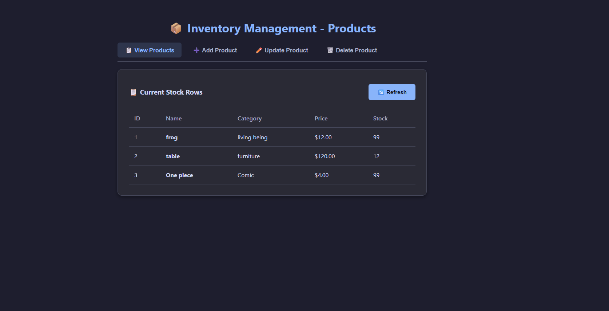
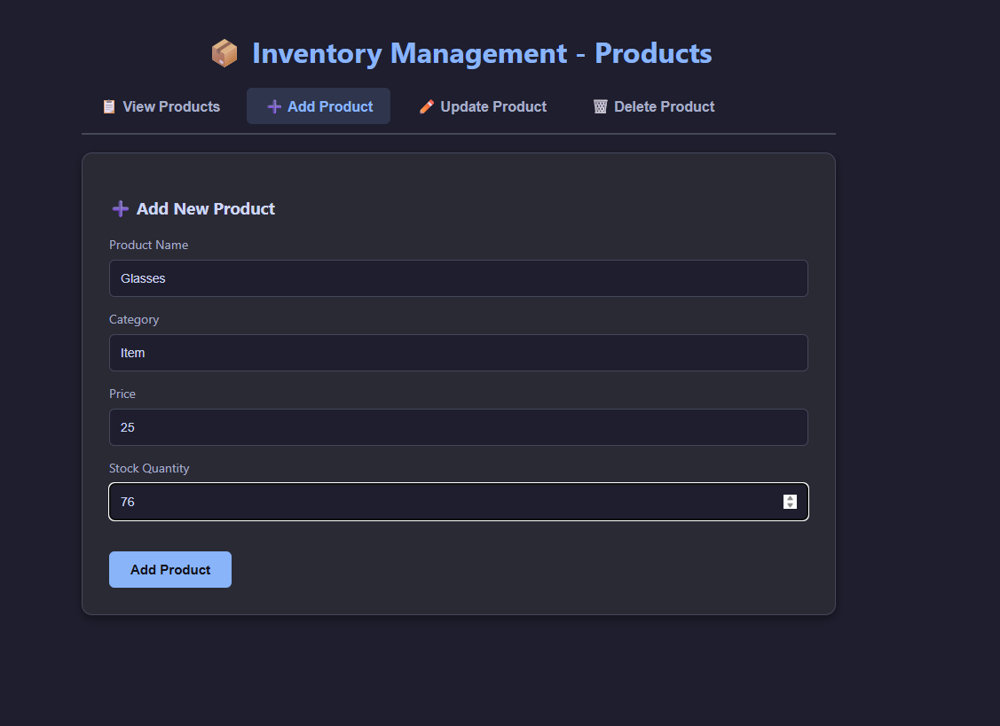

# Product Inventory System

A full-stack inventory management dashboard featuring a high-performance FastAPI backend, custom dynamic MySQL relational database layers, and a responsive, tabbed HTML/JavaScript frontend client interface.

## Features
- **View Products**: See current stock levels in a clean table format.
- **Add Product**: Easily add new items to your inventory database.
- **Update/Delete**: Manage existing stock items with a simple interface.

## Tech Stack
* **Backend:** FastAPI (Python)
* **Database:** MySQL
* **Frontend:** HTML, JavaScript, CSS

## Screenshots

### View Inventory


### Add Product


## Getting Started
(Add instructions here on how to clone and run your project, e.g.)

1. Clone this repository:
   ```bash
   git clone [https://github.com/Ny-ho/product-inventory-system.git](https://github.com/Ny-ho/product-inventory-system.git)
